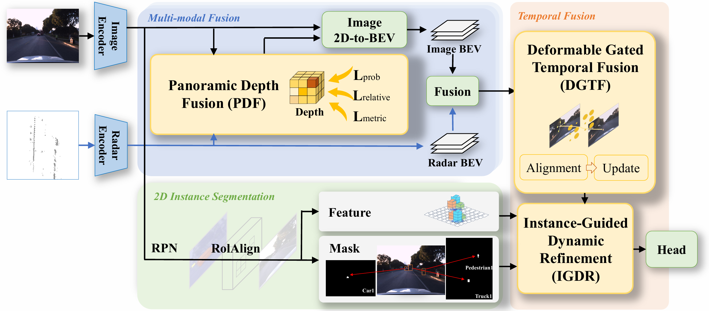
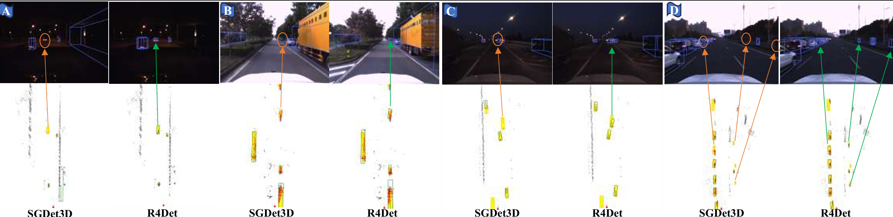
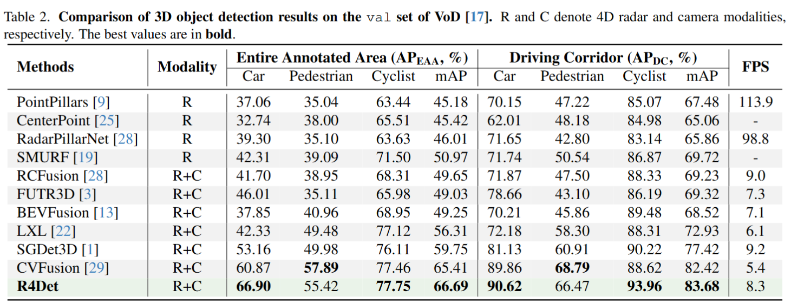
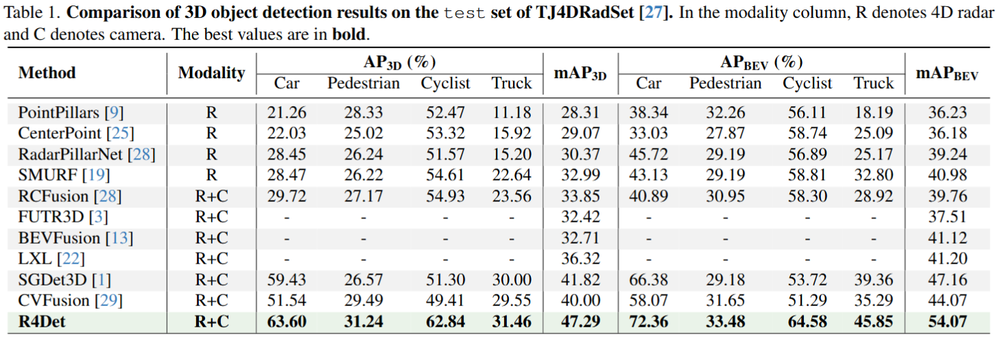

# R4Det

[Paper](https://arxiv.org/abs/2603.11566) | **Zhongyu Xia, Yousen Tang, Yongtao Wang, Zhifeng Wang, Weijun Qin**

This repository contains the official PyTorch implementation of: **R4Det: 4D Radar-Camera Fusion for High-Performance 3D Object Detection**


## Introduction

4D radar-camera sensing has become increasingly important for autonomous driving due to its robustness under adverse weather and low-visibility conditions. However, existing radar-camera 3D object detection methods still suffer from several limitations:

* inaccurate absolute depth estimation,
* unstable temporal fusion under missing ego-pose information,
* weak representation capability for sparse small-object radar returns.
* 
To address these issues, we propose **R4Det**, a unified radar-camera fusion framework for robust 3D object detection. Our framework contains three key components:

* **Panoramic Depth Fusion (PDF)**
  Enhances geometric depth estimation through joint absolute-relative depth modeling.
* **Deformable Gated Temporal Fusion (DGTF)**
  Performs pose-free temporal alignment and gated temporal feature aggregation.
* **Instance-Guided Dynamic Refinement (IGDR)**
  Uses 2D instance-aware prototypes to dynamically calibrate and purify BEV representations.


## Framework Overview

<p align="center">
  
</p>


## Visualization

<p align="center">
  
</p>

Qualitative comparisons on challenging driving scenarios.
R4Det achieves more robust object localization and better small-object detection under sparse radar observations and low-light environments.


## Main Results

Experiments on both **TJ4DRadSet** and **View-of-Delft (VoD)** demonstrate the effectiveness of the proposed framework.

<p align="center">
  
  
</p>


## Getting Started

### Environment Setup

The project relies on customized CUDA operators and OpenMMLab-based 3D perception modules.

Please refer to **[Environment Setup Guide](docs/install.md)** for detailed installation instructions.


### Dataset Preparation

We support:

* **TJ4DRadSet**
* **View-of-Delft (VoD)**

Please refer to **[Dataset Preparation Guide](docs/dataset.md)** for dataset organization and preprocessing steps.

## Training

Distributed training:

```bash
bash ./tools/dist_train.sh ${CONFIG_FILE} ${GPU_NUM}
```

Example:

```bash
bash ./tools/dist_train.sh \
./configs/sgdet3d/vod-R4Det_det3d_2x4_12e.py 1
```

You may replace the configuration file with your own experiment configuration.


## Evaluation

### Evaluate on View-of-Delft (VoD)

```bash
bash test_VoD.sh
```

### Evaluate on TJ4DRadSet

```bash
bash test_TJ4D.sh
```

Please modify the checkpoint path and configuration inside the test scripts before evaluation if necessary.

## Model Zoo

| Dataset    | Model              | Weights     |
| ---------- | ------------------ | ----------- |
| TJ4DRadSet | Pretrained         | Coming Soon |
| TJ4DRadSet | R4Det              | Coming Soon |
| VoD        | Pretrained         | Coming Soon |
| VoD        | R4Det              | Coming Soon |

We recommend placing checkpoints under:
```text
checkpoints/
```


## Acknowledgements

We sincerely thank the authors of the following open-source projects:

* SGDet3D
* MMDetection3D
* Detectron2


## Citation

If you find this work useful for your research, please consider citing:

```bibtex
@article{xia2026r4det,
  title={R4Det: 4D Radar-Camera Fusion for High-Performance 3D Object Detection},
  author={Xia, Zhongyu and Tang, Yousen and Wang, Yongtao and Wang, Zhifeng and Qin, Weijun},
  journal={arXiv preprint arXiv:2603.11566},
  year={2026}
}
```


## License

This project is released for academic research purposes only.

For commercial licensing requests, please contact wyt@pku.edu.cn.
